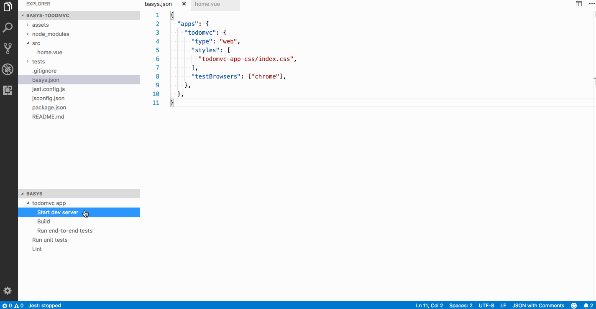

# Basys IDE for VSCode

[Basys](https://github.com/basys/basys) is a full-stack Vue.js framework for cross-platform apps. This extension aims to provide a great development experience inside Visual Studio Code.

## Features

* An easy way to start a new Basys project
* Project overview screen
* Integrated js and style linting
* JSON schema for project configuration file

## Creating a new project

Open the Command Palette and run `Basys: Create project` command. Select the starter template and an empty directory to use for the project. The extension will automatically scaffold the project, install npm packages and start the dev server.

## Running the commands from sidebar explorer view

