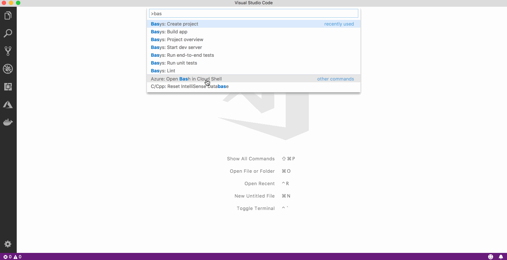

# Basys IDE for VSCode

[Basys](https://github.com/basys/basys) is a Vue.js toolbox for building full-stack cross-platform apps. This extension creates an intuitive developer environment to help you focus on building your app.

## Features

* An easy way to start a new Basys project
* A sidebar panel for running Basys commands without CLI
* Project overview screen
* Integrated js and style linting
* JSON schema for project configuration file

## Creating a new project

Open the Command Palette and run `Basys: Create project` command. Select the starter template and an empty directory to use for the project. The extension will automatically scaffold the project, install npm packages and start the dev server.

## Running the commands from sidebar explorer view

